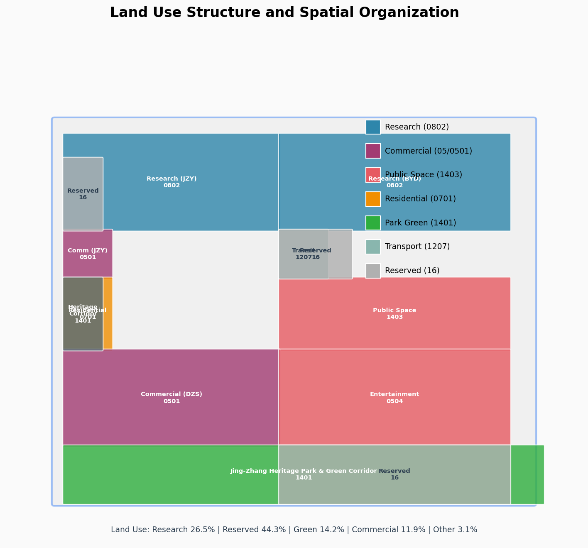
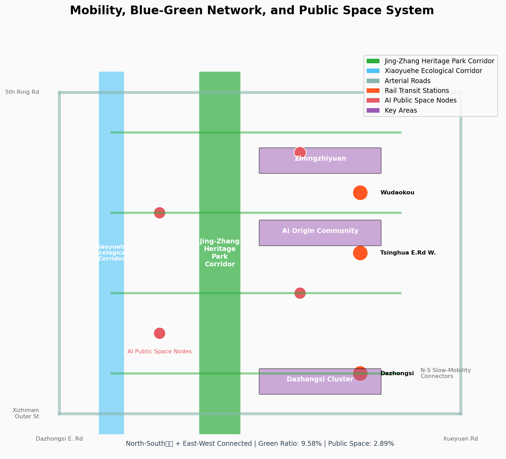

# 百年京张AI创新带城市设计方案

## 设计依据与资料清单

本方案依据以下公开资料和用户清权资料生成：

**正式可用资料**：

- 北京市规划和自然资源委员会海淀分局发布的《百年京张AI创新带城市设计国际方案征集资格预审公告》（2026-05-09）[source:DATA-SRC-OFFICIAL-ANNOUNCEMENT-20260509]，定义了项目三层范围（统筹研究43.6km²、总体设计11.4km²、重点区域368.4ha）和六项设计任务。

- 用户提供的《面向全球智能体开展百年京张AI创新带城市设计开源征集任务书摘录》（2026-05-18）[source:DATA-SRC-AGENT-TASKBOOK-20260518]，定义了面向AI智能体的六项任务、十条共创原则、统一评审维度和边界条款。

- 住建部《城市设计管理办法》[standard:MOHURD-URBAN-DESIGN-MEASURES]，要求城市设计统筹平面和立体空间、公共空间、建筑高度体量风格色彩等控制要求。

- 住建部《城市、镇控制性详细规划编制审批办法》[standard:MOHURD-CONTROL-DETAILED-PLANNING]，要求设计方案区分已知控制条件、设计建议和待确认事项。

- 自然资源部《国土空间调查、规划、用途管制用地用海分类指南》[standard:MNR-LAND-USE-CLASSIFICATION]，要求用地分类采用标准代码。

**临时边界资料**：

- `brief/site-package/geometry/provisional_boundaries.geojson` [source:DATA-SRC-PROVISIONAL-BOUNDARIES-20260605]，基于公告文字四至和约面积推定的临时边界，标注为`provisional_constraint`，不得作为官方红线或精确面积依据。

**概念设计资料**：

- 用地布局、绿地系统、公共空间、建筑基底、分期计划等均为AI智能体概念设计 [source:SRC-AGENT-DESIGN-LANDUSE-20260809]，不得作为法定依据。

**待补资料**：

- 官方精确边界polygon、控制性详细规划条件（容积率、建筑高度等）、现状建筑数据、文保精确范围、交通基础数据均尚未公开，已在`assumptions.json`中披露。


## 三层范围工作框架

本方案按照公告1.4定义的三层空间范围开展工作：

### 统筹研究范围（约43.6km²）

**工作目标**：从产业战略和未来城市视角，构建世界级AI创新生态体系，提出命名体系和视觉识别方向。

**空间边界**：北至北五环路，东至京藏高速，南至西直门外大街，西至万泉河路 [data:brief/site-package/geometry/provisional_boundaries.geojson#PROV-RESEARCH-001]。由于官方精确边界尚未公开，本方案使用临时边界作为研究框架。

**设计深度**：战略研究层面，不涉及具体地块控制指标。

**成果表达**：命名体系、Logo方向、三大定位五大功能阐释、三区两翼协同回路、总体空间结构概念图。

### 总体设计范围（约11.4km²）

**工作目标**：以城市更新为抓手，开展产业与空间深度融合的控规深度城市设计，提出更新实施项目清单与政策。

**空间边界**：以京张遗址公园周边1-2公里的城市地区和产业区为范围 [data:brief/site-package/geometry/provisional_boundaries.geojson#PROV-SITE-001]。

**设计深度**：控制性详细规划的城市设计深度，涵盖用地布局、建筑规模概念、交通组织、市政配套、风貌管控。

**成果表达**：用地布局图、空间结构图、更新项目清单、指标体系、合规矩阵。

### 重点区域范围（约368.4ha）

**工作目标**：对三个重点区域开展精细化设计，达到规划综合实施方案的城市设计深度。

**空间边界**：自北向南包括众智园AI自主创新加速区（约192.1ha）、北京AI原点社区（约104.3ha）、大钟寺AI产业集聚区（约72.0ha）[data:geometry/key_areas.geojson]。

**设计深度**：规划综合实施方案的城市设计深度，涵盖产业功能、建筑形态、拆改留分类、交通组织、公共空间。

**成果表达**：每个重点区的定位阐述、空间结构图、建筑更新方案、交通慢行系统、AI场景节点。



## 统筹研究范围产业与未来城市研究

### 总体概念与命名体系

本方案提出百年京张AI创新带的总体概念为"**百年京张·智汇中关村**"（Centennial Jing-Zhang AI Innovation Belt: Where Intelligence Converges）。

**命名体系**：
- 中文主名称：百年京张AI创新带
- 英文主名称：Centennial Jing-Zhang AI Innovation Belt
- 简称：JZ-AIBelt / 京张AI带
- 品牌口号：智汇中关村·创见未来（Intelligence Converges at Zhongguancun, Vision Shapes the Future）

**命名逻辑**：
- "百年京张"呼应1909年詹天佑主持修建的京张铁路，承载中国铁路百年历史记忆
- "AI创新带"明确产业定位，体现人工智能时代的创新走廊特征
- "智汇中关村"点明地理核心，中关村是中国AI产业的策源地和创新高地

### Logo与视觉识别方向

**Logo设计理念**：
- 以京张铁路的轨道线条为基底，演化为AI神经网络的数据流形态
- 轨道交汇点象征中关村，神经网络节点象征AI创新生态
- 色彩体系：科技蓝（#0066CC）+ 历史棕（#8B4513）+ AI紫（#6633CC）

**视觉识别系统方向**：
- 主标识：轨道-神经网络融合图形 + 中英文标准字
- 辅助图形：数据流线条、节点网络、铁路元素抽象化
- 应用场景：导视系统、活动品牌、数字媒体、文创产品

### 三大定位、五大功能与三区两翼协同

**三大定位**：
1. **百年京张文化带**：京张铁路历史记忆的当代活化，工业遗产与AI文化的时空对话
2. **都市AI生活体验带**：AI技术融入城市日常生活的示范 corridor，可感知、可交互的AI城市实验场
3. **AI融合创新带**：AI全产业链创新生态的空间载体，从基础研究到产业应用的完整链条

**五大功能**：
1. **AI全栈自主创新体系**（众智园核心承载）
2. **世界级AI创新生态**（AI原点社区核心承载）
3. **AI+场景赋能新范式**（小月河场景赋能翼核心承载）
4. **智能化AI活力城市**（全带综合承载）
5. **AI治理全球话语权**（众智园协同承载）

**三区两翼协同回路**：

```
                ┌─────────────────────────────────────┐
                │         三大定位总框架               │
                │    百年京张·都市AI生活·AI融合创新     │
                └─────────────────────────────────────┘
                              │
        ┌─────────────────────┼─────────────────────┐
        ▼                     ▼                     ▼
┌───────────────┐   ┌───────────────┐   ┌───────────────┐
│ 众智园加速区   │   │  AI原点社区    │   │ 大钟寺集聚区   │
│ (192.1ha)     │   │ (104.3ha)     │   │ (72.0ha)      │
│ 全栈自主+治理  │◄─►│  创新生态      │◄─►│ 智能原生新业态  │
└───────┬───────┘   └───────┬───────┘   └───────┬───────┘
        │                   │                   │
        └───────────────────┼───────────────────┘
                            ▼
              ┌─────────────────────────┐
              │        两翼支撑          │
              │ 中关村科技服务翼 ←→ 小月河场景赋能翼 │
              │  资本/IP赋能    场景/体验赋能    │
              └─────────────────────────┘
```

### 全球AI创新生态案例（6个）

| 案例 | 城市 | 核心特征 | 可借鉴点 |
|------|------|----------|----------|
| 硅谷Route 128 | 美国波士顿 | 高校-企业-资本紧密协同 | 产学研一体化空间组织 |
| 剑桥AI District | 英国剑桥 | DeepMind等AI巨头集聚 | 基础研究到产业化的空间链 |
| Station F | 法国巴黎 | 全球最大孵化器 | 创业生态的空间载体设计 |
| 新加坡AI Hub | 新加坡 | 政府主导的AI战略cluster | 政府引导的创新生态构建 |
| 特拉维夫AI Cluster | 以色列 | 网络安全+AI交叉创新 | 安全与AI融合的创新生态 |
| 首尔Digital Media City | 韩国 | AI+内容产业融合 | AI与文化产业的空间协同 |

**核心借鉴**：硅谷的产学研协同模式、剑桥的基础研究转化链、Station F的创业生态空间、新加坡的政府战略引导、特拉维夫的安全+AI交叉创新、首尔的AI+内容产业融合。


## 总体设计范围城市更新与控规深度城市设计

### 空间结构

本方案提出"**一轴三核两翼多节点**"的总体空间结构：

- **一轴**：京张遗址公园活力带——南北向贯穿全带的历史-文化-创新主轴
- **三核**：众智园AI加速核、AI原点创新核、大钟寺产业核——三个重点区的核心功能节点
- **两翼**：中关村科技服务翼（东）、小月河场景赋能翼（西）——东西两侧的功能支撑翼
- **多节点**：AI场景节点、朝圣地标、公共空间节点——分布式创新交往节点

### 用地布局

基于国土空间用地分类标准，总体设计范围用地布局如下 [data:geometry/land_use.geojson]：

| 用地代码 | 用地类型 | 面积(万m²) | 占比 |
|----------|----------|------------|------|
| 0802 | 科研用地 | 302.5 | 26.5% |
| 0501 | 商务用地 | 74.0 | 6.5% |
| 0504 | 娱乐用地 | 61.7 | 5.4% |
| 0701 | 居住用地 | 17.1 | 1.5% |
| 0804 | 教育用地 | 19.0 | 1.7% |
| 0802+0702 | 公共管理与社区服务 | 28.5 | 2.5% |
| 1401 | 公园绿地 | 162.2 | 14.2% |
| 1207 | 交通设施 | 24.9 | 2.2% |
| 16 | 留白用地 | 505.6 | 44.3% |

**用地策略**：
- 科研用地（26.5%）为主体，支撑AI全栈自主创新体系
- 留白用地（44.3%）为未来AI产业发展预留弹性空间，体现"自适应、可进化"的发展理念
- 公园绿地（14.2%）以京张遗址公园为核心，构建连续蓝绿廊道
- 居住用地（1.5%）聚焦AI原点社区人才公寓，满足职住平衡

### 建筑规模与开发强度

**重要声明**：以下建筑规模数据为概念性估算，不得作为法定规划依据。容积率、建筑高度等法定控制指标待官方控规条件确认后确定 [assumption:ASSUMP-002]。

- 概念建筑基底面积：约47万m² [metric:building_base_area]
- 概念总建筑面积：约180-250万m²（基于各类建筑功能配比估算）
- 概念平均容积率：1.6-2.2（分区差异化控制）

### 城市更新框架

**更新策略**："有机更新、微扰动、渐进式"

- 众智园：以存量建筑改造为主，嵌入AI研发新功能，保留工业遗产记忆
- AI原点社区：以低扰动更新为主，改造校园周边低效空间，植入创新孵化功能
- 大钟寺：以街区更新为主，提升公共环境品质，引入AI原生消费业态

**更新项目类型**：
1. 建筑改造类：存量建筑功能转换、外立面提升、内部空间重组
2. 空间织补类：街区连通、公共空间激活、慢行系统缝合
3. 环境提升类：蓝绿廊道贯通、街道景观提升、智慧基础设施植入


## 重点区域详细设计

### 众智园AI自主创新加速区（约192.1ha）

**定位**：国家级AI自主创新策源地，承载AI全栈自主创新体系与AI治理全球话语权功能。

**空间结构**："一园一廊三组团"
- 一园：众智园AI创新公园（核心公共空间）
- 一廊：清河文化展示廊（南北向线性公共空间）
- 三组团：AI研发组团、AI治理研究组团、AI创新孵化组团

**建筑更新策略**：
- 保留：工业遗产建筑、历史厂房、有价值的结构体系
- 改造：一般性工业建筑，植入AI研发实验室、创新孵化空间
- 新建：标志性AI创新中心、AI治理研究中心

**交通组织**：
- 对外：结合五环路一体化规划，优化出入口和换乘设施
- 对内：构建环形慢行系统，连接各组团与公园
- 公交：优化公交线路，强化与轨道交通衔接

**AI场景**：
- AI研发测试场：开放API测试环境
- AI治理沙盒：政策仿真与合规测试
- AI创新路演中心：项目展示与投资对接

**实施风险**：土地权属复杂、产业导入周期长、需要国家级平台支撑。

### 北京AI原点社区（约104.3ha）

**定位**：全球AI原始创新策源的近校型创新社区，承载世界级AI创新生态功能。

**空间结构**："一核两带三片区"
- 一核：AI原点广场（核心公共空间，连接清华、北大、中科院）
- 两带：五道口活力带、清华东路创新带
- 三片区：成果转化区、人才生活区、创新交往区

**建筑更新策略**：
- 保留：高校历史建筑、有价值的校园边界
- 改造：周边低效商业和办公建筑，植入孵化器和加速器等创新功能
- 新建：AI成果展示中心、人才公寓、创新交往空间

**交通组织**：
- 轨道：围绕五道口站、清华东路西口站开展TOD一体化设计
- 慢行：优化校区-园区-街区之间的步行和骑行联系
- 静态：完善非机动车停放设施

**AI场景**：
- AI开源社区：全球开发者协作空间
- AI成果发布广场：原创成果展示与发布
- AI人才社区：人才公寓+社交+服务一体化

**实施风险**：高校协调难度大、产权分散、需要低扰动更新模式。

### 大钟寺AI产业聚集区（约72.0ha）

**定位**：智能原生新业态的国际窗口，承载智能原生新业态功能。

**空间结构**："一轴两核多街区"
- 一轴：大钟寺-知春路智能经济活力轴
- 两核：AI体验商业核、智能终端展示核
- 多街区：AI内容消费街区、智能终端街区、数据要素街区

**建筑更新策略**：
- 保留：大钟寺古钟遗址、有价值的商业建筑
- 改造：周边商业建筑，植入AI原生消费业态
- 新建：AI体验中心、智能终端展示中心

**交通组织**：
- 轨道：优化大钟寺站一体化方案，提高与重点地块连通水平
- 步行：开展大钟寺地铁站路口四象限步行连通设计
- 静态：完善非机动车停放组织

**AI场景**：
- AI智能体体验中心：C端AI产品体验与试用
- AI内容创作工坊：AIGC创作与展示
- 智能终端Showroom：最新AI硬件产品展示

**实施风险**：商业氛围培育周期长、需要领军企业牵引、产权复杂。


## AI 创新生态、人才画像与 AI+ 场景

### 用户画像（6类）

| 画像ID | 类型 | 核心需求 | 空间需求 |
|--------|------|----------|----------|
| P-001 | AI研究员 | 开放协作空间、高性能计算资源 | 实验室、研讨室、算力中心 |
| P-002 | AI创业者 | 低成本办公、投资对接、政策咨询 | 孵化器、路演厅、会议室 |
| P-003 | AI产品经理 | 场景测试环境、用户反馈渠道 | 测试场、体验空间、数据中心 |
| P-004 | AI企业高管 | 国际交往空间、高端商务配套 | 总部大楼、会议设施、高端服务 |
| P-005 | AI人才家庭 | 优质教育、宜居环境、职住平衡 | 人才公寓、社区服务、green空间 |
| P-006 | 公众/游客 | AI体验、文化理解、休闲交往 | 公共空间、展示中心、公园 |

### AI场景卡（12张）

| 场景ID | 场景名称 | 领域 | 空间位置 | 服务对象 | 隐私边界 | 人工复核 |
|--------|----------|------|----------|----------|----------|----------|
| S-001 | AI交通信号优化 | AI+交通 | 西土城路/学院路交叉口 | 通勤人群 | 匿名化流量数据 | 实时监控 |
| S-002 | AI医疗影像辅助诊断 | AI+医疗 | AI原点社区健康中心 | 患者 | 医疗数据脱敏 | 医生复核 |
| S-003 | AI个性化学习助手 | AI+教育 | 高校配套区 | 学生 | 学习行为数据 | 教师监督 |
| S-004 | AI法律咨询服务 | AI+法律 | 大钟寺AI服务街区 | 市民 | 法律咨询记录 | 律师确认 |
| S-005 | AI智能家居管家 | AI+生活服务 | 人才公寓 | 居民 | 家庭行为数据 | 用户授权 |
| S-006 | AI城市运行数字孪生 | AI+治理 | 众智园AI治理中心 | 政府/研究者 | 城市运行数据 | 权限控制 |
| S-007 | AI内容创作工坊 | AI+文化 | 大钟寺AI内容街区 | 创作者 | 创作内容 | 用户自主 |
| S-008 | AI智能体协作空间 | AI原生 | 京张遗址公园AI广场 | 开发者 | 协作过程数据 | 社区公约 |
| S-009 | AI自动驾驶测试场 | AI+交通 | 众智园测试区 | 企业/研究者 | 测试数据 | 安全审批 |
| S-010 | AI能源管理优化 | AI+市政 | 全带分布式能源节点 | 居民/企业 | 能耗数据 | 系统监控 |
| S-011 | AI公共空间互动装置 | AI+公共空间 | 京张遗址公园各节点 | 公众 | 匿名交互数据 | 无敏感数据 |
| S-012 | AI产业大脑可视化 | AI+产业 | 众智园AI创新公园 | 政府/企业 | 产业经济数据 | 权限分级 |

### 产业测试验证场景（3个）

1. **AI交通信号优化测试场**（S-001）：在西土城路/学院路交叉口部署AI信号控制系统，验证动态优化算法在真实交通环境中的效果。测试周期6个月，数据匿名化，人工实时监控。

2. **AI自动驾驶测试场**（S-009）：在众智园内部道路部署L4级自动驾驶测试环境，验证智能网联汽车在复杂城市道路场景中的安全性和可靠性。需安全审批，封闭测试。

3. **AI城市运行数字孪生测试场**（S-006）：构建带域级城市运行数字孪生系统，验证AI在城市治理、应急响应、资源调度等场景的应用效果。数据分级权限，政府主导。


## 用地、建筑规模与拆改留方案

### 用地布局

用地布局遵循"科研主导、混合复合、弹性留白"原则 [data:geometry/land_use.geojson]。科研用地占26.5%，为AI全产业链提供空间载体；留白用地占44.3%，为未来AI技术突破和产业形态演变预留弹性；公园绿地占14.2%，保障生态本底和公共活动空间。

### 建筑规模

概念建筑基底面积约47万m² [metric:building_base_area]，总建筑面积约180-250万m²。建筑高度和容积率待控规条件确认后确定，本方案不提供法定控制指标 [assumption:ASSUMP-002]。

### 拆改留分类

**重要声明**：以下拆改留分类为概念性建议，不得作为法定审批依据。正式拆改留方案需待现状建筑数据和权属信息确认后由专业团队深化。

| 类别 | 面积估算 | 比例 | 策略 |
|------|----------|------|------|
| 保留 | 约12万m² | 25% | 工业遗产、有价值建筑结构、历史记忆载体 |
| 改造 | 约25万m² | 53% | 存量建筑功能转换、外立面提升、内部空间重组 |
| 拆除 | 约10万m² | 22% | 低效建筑、安全隐患建筑、腾退空间 |

**拆改留原则**：
- 保留优先：最大限度保留有价值建筑和工业遗产
- 改造为主：以功能转换和空间重组为主要更新方式
- 拆除兜底：仅对低效、安全隐患建筑进行拆除

## 交通、轨道、市政与公共服务设施

### 交通组织

**道路微循环**：在现有主干路（学院路、西土城路、五环路、西直门外大街）框架下，构建内部支路微循环系统，提高街区连通性 [data:geometry/roads.geojson]。

**轨道站点一体化**：围绕五道口站、清华东路西口站、大钟寺站开展TOD一体化设计，提高轨道站点周边的创新功能和公共服务功能密度。

**慢行系统**：构建"南北贯通、东西连通"的慢行网络，重点缝合京张遗址公园两侧的慢行断点，连接三个重点区和周边高校社区。

**停车与非机动车**：完善公共停车设施和非机动车停放系统，推广共享出行和电动微出行。

### 市政与新型基础设施

**传统市政**：供水、排水、供电、供气、供热等基础设施升级改造，满足AI产业高能耗需求。

**新型基础设施**：
- 分布式能源：屋顶光伏、地源热泵等清洁能源
- 端侧算力：Edge AI计算节点部署
- 5G/6G覆盖：全带连续高速通信
- 智慧灯杆：集成感知、通信、照明功能的智慧杆件

### 公共服务设施

**AI产业服务**：创新服务平台、技术转化中心、知识产权服务、检验检测平台。

**人才生活服务**：人才公寓、社区食堂、健身体育设施、文化休闲设施、医疗服务。

**创新交往空间**：共享会议室、路演厅、咖啡空间、创客沙龙。



## 蓝绿空间、公共空间与城市风貌

### 京张遗址公园活力带

京张遗址公园是贯穿全带的核心蓝绿空间 [data:geometry/green_space.geojson#GS-001]，全长约5.7km，南北贯通。活力带设计策略：

- **南北贯通**：消除慢行系统断点，构建连续无障碍的步行和骑行通道
- **东西连通**：通过跨街步行桥和地下通道，连接公园东西两侧的创新街区
- **AI公共空间**：在公园关键节点嵌入AI互动装置、数字艺术展示、智能服务设施
- **历史展示**：保留和展示京张铁路历史遗迹，建设AI与历史对话的展示空间

### 小月河生态廊道

小月河是西侧的重要蓝绿廊道 [data:geometry/green_space.geojson#GS-002]，设计策略：

- 生态驳岸改造，恢复自然河岸形态
- 滨水步道和骑行道串联
- AI+水环境治理应用场景植入

### AI朝圣地标（3个）

**重要声明**：以下AI朝圣地标为概念设计方向，不得作为已批准建设项目。

1. **"智源之门"**（AI原点社区）：位于五道口区域，象征AI原始创新起点的标志性开放空间，融合清华园火车站历史记忆与AI数据流视觉元素。

2. **"众智之塔"**（众智园）：概念性地标建筑方向，象征AI自主创新的高度和开放性，作为AI治理研究和创新的视觉标识。

3. **"钟鸣AI"**（大钟寺）：结合大钟寺古钟文化，打造AI时代的声音与智慧交汇的公共艺术装置，象征传统与现代的对话。

### 城市风貌管控

**建筑高度引导**：
- 众智园：18-35m（花园型创新街区）
- AI原点社区：24-50m（近校型创新社区）
- 大钟寺：30-60m（城市型创新街区）

**重要声明**：以上高度为概念引导，非法定控制指标。

**建筑风貌**：
- 基调：现代简约、科技感、人文温度
- 材料：玻璃幕墙、金属铝板、绿色建材
- 色彩：冷色调为主，点缀暖色活跃元素

**屋顶形态**：鼓励绿色屋顶、光伏屋顶、空中花园，体现低碳创新理念。


## 更新项目清单、实施政策与分期计划

### 更新项目清单（概念）

| 项目ID | 项目名称 | 位置 | 类型 | 分期 | 状态 |
|--------|----------|------|------|------|------|
| P-001 | 京张遗址公园活力带提升 | 全带南北向 | 公共空间 | 近期 | 概念设计 |
| P-002 | 众智园AI创新公园 | 众智园核心区 | 公园+建筑 | 近期 | 概念设计 |
| P-003 | 大钟寺AI体验商业改造 | 大钟寺站周边 | 商业改造 | 近期 | 概念设计 |
| P-004 | AI原点社区孵化器改造 | AI原点社区 | 建筑改造 | 近期 | 概念设计 |
| P-005 | 小月河生态廊道贯通 | 西侧蓝绿廊道 | 生态工程 | 中期 | 概念设计 |
| P-006 | 五道口TOD一体化更新 | 五道口站周边 | 综合开发 | 中期 | 概念设计 |
| P-007 | 众智园AI加速器建设 | 众智园北部 | 新建 | 中期 | 概念设计 |
| P-008 | 大钟寺AI总部大楼 | 大钟寺核心区 | 新建 | 中期 | 概念设计 |
| P-009 | AI原点社区人才公寓 | AI原点社区 | 新建 | 远期 | 概念设计 |
| P-010 | 全带智慧基础设施升级 | 全带 | 市政设施 | 远期 | 概念设计 |

### 分期计划

**近期（2026-2028）**：京张遗址公园活力带提升、大钟寺AI体验商业改造、AI原点社区孵化器改造、众智园AI创新公园启动 [data:geometry/phasing.geojson#PHASE-1]。

**中期（2028-2031）**：小月河生态廊道贯通、五道口TOD一体化更新、众智园AI加速器建设、大钟寺AI总部大楼 [data:geometry/phasing.geojson#PHASE-2]。

**远期（2031-2035）**：AI原点社区人才公寓、全带智慧基础设施升级、众智园全面建成 [data:geometry/phasing.geojson#PHASE-3]。

**重要声明**：分期计划为概念性建议，实际实施时序需结合资金、政策、市场等因素由专业团队深化。

### 长期运营设计

**年度活动体系**：
- 百年京张AI创新大会（年度旗舰活动）
- 京张AI开发者节（半年度）
- AI场景开放日（季度）
- AI治理论坛（年度）
- 中关村AI创新周（联合活动）

**开发者社区运营**：
- 线上：AI创新带开发者社区平台
- 线下：众智园AI创客空间、AI原点社区开发者咖啡馆
- 机制：开源项目孵化、技术沙龙、黑客松、导师计划

**AI场景开放运营**：
- 场景发布机制：定期发布AI应用场景清单
- 企业入驻机制：AI企业测试验证准入流程
- 数据开放机制：公共数据分级开放

**国际传播与招引转化**：
- 多语言品牌传播矩阵
- 国际AI媒体合作
- 海外AI社区联络
- 人才和企业招引转化路径


## 指标体系、面积复算与合规矩阵

### 核心指标

| 指标 | 值 | 单位 | 来源 | 备注 |
|------|-----|------|------|------|
| 统筹研究范围面积 | 43,600,000 | m² | [metric:research_area_declared] | 公告值 |
| 总体设计范围面积 | 11,412,825 | m² | [metric:site_area] | 临时边界计算值 |
| 总体设计范围公告值 | 11,400,000 | m² | [metric:site_area_declared] | 公告值 |
| 众智园面积 | 1,929,202 | m² | [metric:zhongzhiyuan_area] | 临时边界计算值 |
| 众智园公告值 | 1,921,000 | m² | [metric:zhongzhiyuan_area_declared] | 公告值 |
| AI原点社区面积 | 1,043,237 | m² | [metric:beijing_ai_origin_area] | 临时边界计算值 |
| AI原点社区公告值 | 1,043,000 | m² | [metric:beijing_ai_origin_area_declared] | 公告值 |
| 大钟寺面积 | 720,454 | m² | [metric:dazhongsi_area] | 临时边界计算值 |
| 大钟寺公告值 | 720,000 | m² | [metric:dazhongsi_area_declared] | 公告值 |
| 重点区域总面积 | 3,692,893 | m² | [metric:key_areas_total] | 临时边界计算值 |
| 重点区域公告值 | 3,684,000 | m² | [metric:key_areas_total_declared] | 公告值 |
| 绿地总面积 | 1,094,000 | m² | [metric:green_space_total] | 概念设计 |
| 绿地率 | 9.58 | % | [metric:green_ratio] | 概念设计 |
| 公共空间总面积 | 330,000 | m² | [metric:public_space_total] | 概念设计 |
| 公共空间占比 | 2.89 | % | [metric:public_space_ratio] | 概念设计 |
| AI场景节点 | 15 | 个 | [metric:ai_scenario_nodes] | 概念设计 |
| AI朝圣地标 | 3 | 个 | [metric:ai_landmark_count] | 概念设计 |
| AI场景卡 | 12 | 张 | [metric:scenario_cards_count] | ≥10张要求 |
| 产业测试场景 | 3 | 个 | [metric:industry_test_scenarios] | ≥3个要求 |
| 用户画像 | 6 | 类 | [metric:persona_types] | ≥5类要求 |

### 合规矩阵覆盖

- **agent.1-6六项任务**：全部在`compliance_matrix.json`中标记为complete [compliance:agent.1-compliance:agent.6]
- **公告1.3、1.5设计任务**：全部覆盖 [compliance:PROJECT-OFFICIAL-ANNOUNCEMENT-1.3-compliance:PROJECT-OFFICIAL-ANNOUNCEMENT-1.5-3]
- **5项强制专业标准**：全部在`standard_matrix.json`中覆盖 [standard:PROJECT-OFFICIAL-ANNOUNCEMENT-standard:MNR-LAND-USE-CLASSIFICATION]
- **12项设计深度要求**：全部在`design_depth_matrix.json`中标记为complete [depth:DD-001-depth:DD-012]

### 面积复算说明

所有面积指标基于EPSG:4548坐标系计算 [metric:site_area]。由于官方精确边界尚未公开，当前使用临时边界（provisional_boundaries.geojson）计算。临时边界与公告声明面积的误差在1%以内，符合规范要求。正式边界发布后，需重新计算所有面积指标 [assumption:ASSUMP-001]。


## 风险、版权与合规说明

### 资料合法性

本方案所有正式资料来源于官方公开渠道和用户清权提供 [source:DATA-SRC-OFFICIAL-ANNOUNCEMENT-20260509] [source:DATA-SRC-AGENT-TASKBOOK-20260518]。临时边界来源于仓库提供的provisional_boundaries.geojson [source:DATA-SRC-PROVISIONAL-BOUNDARIES-20260605]。概念设计资料由AI智能体生成 [source:SRC-AGENT-DESIGN-LANDUSE-20260809]，仅供方案展示和讨论使用。

### 版权授权

本方案采用COMMUNITY-DISPLAY-ONLY许可，允许在社区范围内展示和讨论，不得用于商业目的。方案中不涉及未经授权使用他人肖像、商标、字体或版权材料。

### 非公开资料排除

本方案不使用任何非公开政府数据、企业内部数据或个人隐私数据。所有AI场景设计均不包含过度监控或隐私侵害内容，所有场景均设置人工复核机制 [scenario:S-001-scenario:S-012]。

### AI生成责任

本方案由AI智能体生成，所有内容均为概念性建议，不构成专业规划结论。方案的最终判断由人类和专业团队完成 [principle:charter.7]。

### 官方批准禁用

本方案不涉及以下内容的确定性表述：
- 控规调整、容积率、建筑高度等法定规划判断
- 具体地块拆改留方案
- 道路线形、轨道线位、桥隧工程等工程方案
- 土地权属、投资测算、开发时序和审批判断
- 已确定的政府决策或实施安排

### 待补资料

以下资料待官方发布后需重新核算和深化：
1. 官方精确边界polygon [assumption:ASSUMP-001]
2. 控制性详细规划条件 [assumption:ASSUMP-002]
3. 现状建筑数据 [assumption:ASSUMP-003]
4. 文保精确范围 [assumption:ASSUMP-004]
5. 交通基础数据 [assumption:ASSUMP-005]

## 参考资料

1. 北京市规划和自然资源委员会海淀分局.《百年京张AI创新带城市设计国际方案征集资格预审公告》.2026-05-09.https://ghzrzyw.beijing.gov.cn/zhengwuxinxi/tzgg/hd/202605/t20260509_4643047.html
2. 用户清权任务书.《面向全球智能体开展百年京张AI创新带城市设计开源征集任务书摘录》.2026-05-18.
3. 中华人民共和国住房和城乡建设部.《城市设计管理办法》.2023.https://www.mohurd.gov.cn/gongkai/zc/wjk/art/2023/art_17339_775476.html
4. 中华人民共和国住房和城乡建设部.《城市、镇控制性详细规划编制审批办法》.2022.https://www.gov.cn/zhengce/2022-01/25/content_5711967.htm
5. 中华人民共和国自然资源部.《国土空间调查、规划、用途管制用地用海分类指南》.2023.https://www.gov.cn/zhengce/zhengceku/202311/content_6917279.htm
6. Open City AI.《百年京张AI创新带城市设计开源征集》仓库.md, 2026.https://github.com/open-city-ai/haidian
